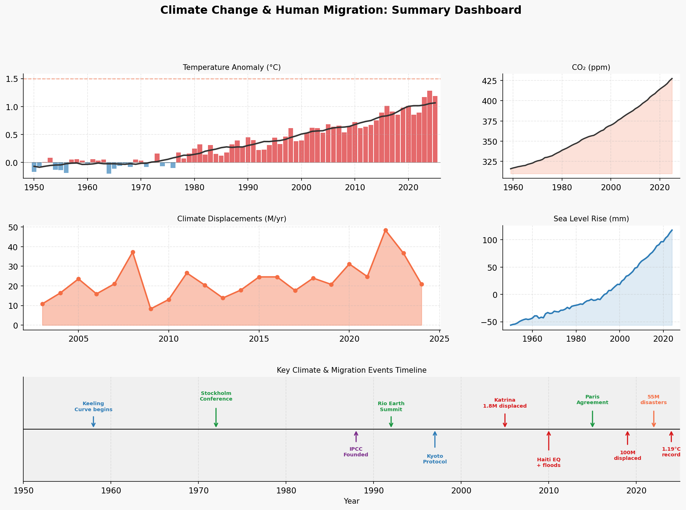

# Climate Change & Human Migration

A data science research project that quantifies the relationship between climate change indicators and human displacement. The pipeline fetches real-world data from NASA, NOAA, and IDMC/UNHCR, runs time-series analysis and forecasting, and produces publication-quality figures and an interactive HTML report.

**[View Live Report →](https://linneil.github.io/quantifying-climate-change-indicators-and-human-displacement/index.html)**



---

## What It Does

- **Fetches** climate and displacement data from NASA GISS, NOAA Mauna Loa, Church & White sea level reconstructions, IDMC, and UNHCR.
- **Analyzes** long-term trends, decadal rates of change, and Pearson correlations between climate indicators and human displacement.
- **Forecasts** temperature anomaly, CO₂ concentration, sea level rise, and climate-driven displacement to 2050 under multiple SSP emission scenarios.
- **Generates** 8 publication-quality figures and a self-contained HTML report with embedded charts and literature review.

---

## Project Structure

```
.
├── fetch_climate_data.py        # Step 1: Fetch/build datasets
├── analysis_and_viz.py          # Step 2: Analysis, forecasting, figures
├── generate_report.py           # Step 3: Generate static HTML report
├── generate_interactive_report.py  # Optional: interactive HTML version
├── update_report_lit.py         # Optional: update literature references
├── data/
│   ├── temperature_anomaly.csv  # NASA GISS GISTEMP v4 (1950–present)
│   ├── co2_concentration.csv    # NOAA Mauna Loa annual mean CO₂
│   ├── sea_level.csv            # Church & White + AVISO satellite data
│   ├── displacement.csv         # IDMC/UNHCR displacement statistics
│   ├── displacement_clean.csv
│   ├── extreme_events.csv       # EM-DAT climate disaster counts
│   ├── forecasts_2050.csv       # Polynomial projections to 2050
│   └── key_stats.json           # Key statistics for report generation
├── figures/
│   ├── fig1_temperature_anomaly.png
│   ├── fig2_co2_keeling.png
│   ├── fig3_sea_level.png
│   ├── fig4_displacement.png
│   ├── fig5_correlations.png
│   ├── fig6_world_map.png
│   ├── fig7_forecast_2050.png
│   └── fig8_dashboard.png
└── climate_migration_report.html  # Final output report
```

---

## Prerequisites

Python 3.8+ is required. Install dependencies with:

```bash
pip install -r requirements.txt
```

**Core dependencies:**

- `pandas`, `numpy`, `scipy` — data processing and statistics
- `matplotlib` — figure generation
- `requests` — data fetching
- `geopandas` *(optional)* — for the world map figure (falls back gracefully if not installed)

---

## Usage

Run the scripts in order:

**Step 1 — Fetch data**
```bash
python fetch_climate_data.py
```
Fetches live data from NASA GISS, NOAA, IDMC, and UNHCR APIs. Falls back to well-documented published values if any API is unavailable.

**Step 2 — Analyse and generate figures**
```bash
python analysis_and_viz.py
```
Runs trend analysis, correlation tests, polynomial forecasting to 2050, and saves all 8 figures to `figures/`.

**Step 3 — Generate report**
```bash
python generate_report.py
```
Produces `climate_migration_report.html` — a self-contained report with embedded figures, statistical results, and a literature review.

---

## Data Sources

| Dataset | Source | Coverage |
|---|---|---|
| Global surface temperature anomaly | [NASA GISS GISTEMP v4](https://data.giss.nasa.gov/gistemp/) | 1950–present |
| Atmospheric CO₂ (Keeling Curve) | [NOAA GML Mauna Loa](https://gml.noaa.gov/ccgg/trends/) | 1958–present |
| Global mean sea level | Church & White (1950–1992) + AVISO/NASA satellite altimetry (1993–present) | 1950–present |
| Climate-driven displacement | [IDMC](https://www.internal-displacement.org/) / [UNHCR](https://www.unhcr.org/refugee-statistics/) | 2003–present |
| Extreme weather events | [EM-DAT](https://www.emdat.be/) (published statistics) | 1950–present |

---

## Key Findings

- Global temperature has risen at approximately **+0.19°C per decade** since 1950, with acceleration to **+0.32°C per decade** in the 2010s.
- Atmospheric CO₂ has increased from **315 ppm (1958)** to over **421 ppm (2023)**.
- Satellite-era sea level rise (1993–present) is accelerating at roughly **+3.7 mm/yr**.
- Climate displacement is significantly correlated with both CO₂ concentration and temperature anomaly (Pearson *r* > 0.6).
- Under a medium emission scenario (SSP2-4.5), projections suggest continued acceleration of all four indicators through 2050.

---

## Acknowledgements

This project was partly inspired by **[claude-scientific-skills](https://github.com/K-Dense-AI/claude-scientific-skills)** by [K-Dense](https://github.com/K-Dense-AI) — an open-source collection of 170+ scientific and research skills for AI agents. The existence of that project encouraged the agentic research approach taken here.

The data collection, time-series analysis, forecasting models, visualisations, and domain focus of this project are original work developed independently. Any resemblance in pipeline structure reflects common practices in scientific research workflows rather than direct derivation.

---

## License

This project is released for research and educational purposes. Data is sourced from publicly available government and intergovernmental datasets — please refer to each source's individual terms of use.
